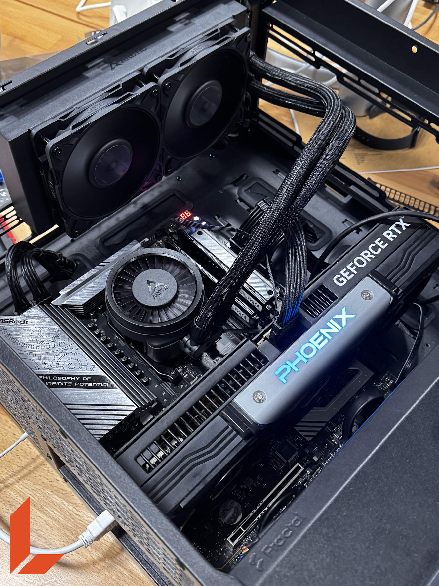

# HPC Workflow with Docker, Conda and Slurm (GPU Nodes, No System Installation)

This document describes a lightweight HPC workflow for running GPU‑accelerated projects (e.g., Gaussian Splatting) on a cluster.

The design goal is:

- Users do **not** install anything system‑wide.
- All CUDA, Conda, Python environments, and datasets live **inside Docker containers** and under each user’s `/data/users/<user>/` directory.
- Workloads are executed via **Slurm (`sbatch`)** on GPU nodes.
- Everything remains clean, reproducible, and scalable.

---

## 0. Connecting to the Server

You can connect **from terminal** or **using Visual Studio Code Remote SSH**.

### Terminal access

```
ssh <user>@<server_ip>
```

Enter your password.

If you don’t know your credentials, ask **Kevin**.

---

### VSCode Remote SSH (Optional)

Add this to your local SSH config:

```
Host ishimura
    HostName askForIP
    User YourUser
    IdentityFile ~/.ssh/id_rsa
```

Then connect:

```
ssh ishimura
```

VSCode will request your SSH password if needed.

---

## 1. Workspace Structure

Once inside the server, navigate to your personal workspace:

```
cd /data/users/<your_user>/
```

Work **inside the `projects/` directory**:

```
cd projects
```

Clone all repositories you need:

```
git clone https://github.com/your-org/gaussian-splatting.git
git clone https://github.com/your-org/other-project.git
```

---

## 2. Recommended Directory Structure

```
/data/users/<user>/
├── projects/
│   └── gaussian-splatting/
└── gs-conda/          # persistent conda environments and package cache
```

---

## 3. Dockerfile (Base Image)

Create:

```
/data/users/<user>/projects/gaussian-splatting/Dockerfile
```

```
FROM nvidia/cuda:11.8.0-devel-ubuntu22.04

ENV DEBIAN_FRONTEND=noninteractive

RUN apt-get update && apt-get install -y git wget build-essential cmake && rm -rf /var/lib/apt/lists/*

ENV CONDA_DIR=/opt/conda
RUN wget --quiet https://repo.anaconda.com/miniconda/Miniconda3-latest-Linux-x86_64.sh -O /tmp/miniconda.sh &&     bash /tmp/miniconda.sh -b -p $CONDA_DIR &&     rm /tmp/miniconda.sh

ENV PATH=$CONDA_DIR/bin:$PATH

RUN useradd -m -s /bin/bash appuser
USER appuser
WORKDIR /workspace

RUN echo ". /opt/conda/etc/profile.d/conda.sh" >> ~/.bashrc

ENV CUDA_HOME=/usr/local/cuda
ENV PATH=$CUDA_HOME/bin:$PATH
ENV LD_LIBRARY_PATH=$CUDA_HOME/lib64:$LD_LIBRARY_PATH

CMD ["/bin/bash"]
```

---

## 4. Build the Docker Image

```
cd /data/users/<user>/projects/gaussian-splatting
docker build -t gaussian-splatting-cuda .
```

---

## 5. Conda Cache Directory

```
mkdir -p /data/users/<user>/gs-conda
```

---

## 6. Optional Interactive Run

```
docker run --gpus all --rm -it   -v /data/users/<user>/projects/gaussian-splatting:/workspace/gaussian-splatting   -v /data/users/<user>/gs-conda:/home/appuser/.conda   gaussian-splatting-cuda
```

Inside:

```
cd /workspace/gaussian-splatting
. /opt/conda/etc/profile.d/conda.sh
conda env create --file environment.yml
conda activate gaussian_splatting
```

---

## 7. Daily Workflow

```
cd /workspace/gaussian-splatting
. /opt/conda/etc/profile.d/conda.sh
conda activate gaussian_splatting
```

---

## 8. Mounting Additional Data

```
docker run --gpus all --rm -it   -v /data/users/<user>/projects/gaussian-splatting:/workspace/gaussian-splatting   -v /data/users/<user>/gs-conda:/home/appuser/.conda   -v /data/users/<user>/data:/workspace/data   gaussian-splatting-cuda
```

Inside:

```
/workspace/data/<dataset_name>
```

---

## 9. HPC Integration with Slurm (sbatch + Docker)

### Example Slurm Script

Create `run_gs_sbatch.sh`:

```
#!/bin/bash
#SBATCH --partition=main
#SBATCH --gres=gpu:1
#SBATCH --job-name=gs-bush6
#SBATCH --output=logs/gs-bush6-%j.out
#SBATCH --error=logs/gs-bush6-%j.err
#SBATCH --cpus-per-task=8
#SBATCH --mem=16G
#SBATCH --time=12:00:00

set -e

cd /data/users/engineer/projects/gaussian-splatting
mkdir -p logs

docker run --gpus all --rm   -v /data/users/engineer/projects/gaussian-splatting:/workspace/gaussian-splatting   -v /data/users/engineer/gs-conda:/home/appuser/.conda   gaussian-splatting-cuda   bash -lc '
    cd /workspace/gaussian-splatting
    . /opt/conda/etc/profile.d/conda.sh
    conda activate gaussian_splatting

    python train.py       -s data/forestPlaza       -m outputs/forestPlaza       --iterations 50000       --save_iterations 1000 3000 50000       --checkpoint_iterations 1000 3000 50000       -r 2
  '
```

Submit:

```
sbatch run_gs_sbatch.sh
```

---

## 10. Optional: Dataset Extraction via AWS S3

Example extractor:

```
import boto3

AWS_ACCESS_KEY_ID = ""
AWS_SECRET_ACCESS_KEY = ""
AWS_REGION = ""

s3 = boto3.client(
    "s3",
    region_name=AWS_REGION,
    aws_access_key_id=AWS_ACCESS_KEY_ID,
    aws_secret_access_key=AWS_SECRET_ACCESS_KEY,
)

def download():
    bucket_name = "cenarius"
    object_key = "gaussian/gaussian_data.zip"
    local_path = "/data/users/engineer/projects/gaussian-splatting/data/gaussian_data.zip"

    print("Starting download...")
    s3.download_file(bucket_name, object_key, local_path)
    print(f"Download finished: {local_path}")

if __name__ == "__main__":
    print("Gaussian data downloader")
    print("------------------------")
    download()
    print("You can now run the training script using that data.")
```

If you need AWS configuration, ask **Zoltan**.


//////////// VM WINDOWS


# Windows 11 VM on Ubuntu (TTY) using KVM/QEMU + libvirt (VNC over Tailscale)

This README documents the full installation and configuration of a **Windows 11 (Home)** virtual machine on an Ubuntu server running **TTY-only (no GUI)** using **KVM/QEMU + libvirt**.  
Installation and GUI access were done via **VNC**, securely reachable through **Tailscale**.

---

## Table of Contents
1. [Server Storage Layout](#1-server-storage-layout)
2. [Issue: Root Filesystem Was Full](#2-issue-root-filesystem-was-full)
3. [Fix: Extend Root Volume (LVM)](#3-fix-extend-root-volume-lvm)
4. [VM Storage Layout on /data](#4-vm-storage-layout-on-data)
5. [Download VirtIO Driver ISO](#5-download-virtio-driver-iso)
6. [Install Virtualization Packages](#6-install-virtualization-packages)
7. [Create the Windows Virtual Disk](#7-create-the-windows-virtual-disk)
8. [Create & Start Windows 11 VM](#8-create--start-windows-11-vm)
9. [VNC Access (Port & Display)](#9-vnc-access-port--display)
10. [Tailscale + Firewall for VNC](#10-tailscale--firewall-for-vnc)
11. [Windows Installer: Load VirtIO Drivers](#11-windows-installer-load-virtio-drivers)
12. [VM Management Commands](#12-vm-management-commands)
13. [IP / Connectivity Notes](#13-ip--connectivity-notes)

---

## 1) Server Storage Layout

The server has two NVMe drives:

### OS Drive (Ubuntu)
- Disk: `nvme1n1` (Samsung SSD 990 PRO 2TB)
- Partitions:
  - `/boot/efi` (vfat) → `nvme1n1p1` (1G)
  - `/boot` (ext4) → `nvme1n1p2` (2G)
  - LVM PV → `nvme1n1p3` (~1.8T)
- Root filesystem (`/`) is an LVM logical volume:
  - LV: `/dev/mapper/ubuntu--vg-ubuntu--lv`
  - FS: ext4
  - Initially sized at **100G**

### Data Drive (/data)
- Disk: `nvme0n1` (Samsung SSD 990 EVO Plus 4TB)
- Partition:
  - LVM PV → `nvme0n1p1` (~3.6T)
- Mounted filesystem:
  - LV: `/dev/mapper/vg_data-lv_data`
  - FS: xfs
  - Mounted at `/data`

### Useful inspection commands
```bash
df -hT
lsblk -o NAME,SIZE,TYPE,FSTYPE,MOUNTPOINT,LABEL,UUID
sudo fdisk -l
sudo pvs && sudo vgs && sudo lvs
```

---

## 2) Issue: Root Filesystem Was Full

During initial attempts to download VirtIO drivers, root was 100% full:

```bash
df -h /
# /dev/mapper/ubuntu--vg-ubuntu--lv  98G  98G  0  100% /
```

This prevented downloading large files and affected normal system operations.

### Space usage analysis
```bash
sudo du -xh / --max-depth=1 2>/dev/null | sort -hr | head -n 20
sudo du -xh /var --max-depth=1 2>/dev/null | sort -hr | head -n 20
```

Largest consumer identified:
- `/var/lib` (~54G)

---

## 3) Fix: Extend Root Volume (LVM)

Because Ubuntu was installed using **LVM**, the volume group had lots of free space:

```bash
sudo vgs
sudo lvs
sudo pvs
```

Key output:
- `ubuntu-vg` had about **1.72T free** (`VFree <1.72t`)

Root LV and filesystem were expanded online (no reboot):

```bash
sudo lvextend -L +300G /dev/mapper/ubuntu--vg-ubuntu--lv
sudo resize2fs /dev/mapper/ubuntu--vg-ubuntu--lv
df -h /
```

> The increment (+300G) can be adjusted. The goal was to restore stability and allow ISO downloads.

---

## 4) VM Storage Layout on /data

All VM assets were stored on `/data` to avoid filling root again:

```bash
sudo mkdir -p /data/isos /data/vms
sudo chmod 755 /data/isos /data/vms
```

### Windows 11 ISO location
Windows ISO already existed on disk:

```text
/data/users/engineer/Win11_25H2_English_x64.iso
```

---

## 5) Download VirtIO Driver ISO

VirtIO drivers are required so Windows can detect VirtIO storage/network devices.

```bash
cd /data/isos
sudo rm -f virtio-win.iso
sudo curl -L -o virtio-win.iso https://fedorapeople.org/groups/virt/virtio-win/direct-downloads/stable-virtio/virtio-win.iso
ls -lh /data/isos/virtio-win.iso
```

Expected size:
- ~753M (observed ~754M)

---

## 6) Install Virtualization Packages

Windows 11 requires UEFI and TPM support.

```bash
sudo apt update
sudo apt install -y \
  qemu-kvm libvirt-daemon-system libvirt-clients virtinst \
  ovmf swtpm swtpm-tools

sudo systemctl enable --now libvirtd
sudo systemctl is-active libvirtd
```

---

## 7) Create the Windows Virtual Disk

A thin-provisioned QCOW2 disk (200G) was created:

```bash
sudo qemu-img create -f qcow2 /data/vms/win11.qcow2 200G
ls -lh /data/vms/win11.qcow2
```

---

## 8) Create & Start Windows 11 VM

### VM Configuration
- Name: `win11`
- RAM: **8192 MB**
- vCPU: **4**
- CPU: host passthrough (`--cpu host`)
- Machine type: `q35`
- Boot: **UEFI**
- TPM: **emulated TPM 2.0**
- Disk: VirtIO (`bus=virtio`)
- Network: libvirt default NAT network (VirtIO model)
- Graphics: **VNC**, listening on `0.0.0.0`

### Command used
```bash
sudo virt-install \
  --name win11 \
  --ram 8192 \
  --vcpus 4 \
  --cpu host \
  --machine q35 \
  --boot uefi \
  --tpm backend.type=emulator,backend.version=2.0 \
  --disk path=/data/vms/win11.qcow2,format=qcow2,bus=virtio \
  --cdrom /data/users/engineer/Win11_25H2_English_x64.iso \
  --disk path=/data/isos/virtio-win.iso,device=cdrom \
  --os-variant win11 \
  --network network=default,model=virtio \
  --graphics vnc,listen=0.0.0.0 \
  --noautoconsole
```

---

## 9) VNC Access (Port & Display)

The VNC display was checked with:

```bash
sudo virsh vncdisplay win11
```

Output:
```text
:0
```

That corresponds to:
- VNC port: **5900**
- Connection: `server_ip:5900`

To verify it is listening:

```bash
sudo ss -lntp | grep 5900
```

Expected output includes QEMU listening on `0.0.0.0:5900`.

---

## 10) Tailscale + Firewall for VNC

### Host Tailscale IPv4
```bash
tailscale ip -4
```

Observed:
```text
100.127.20.62
```

### Firewall rule (restrict to Tailscale range only)
```bash
sudo ufw allow from 100.64.0.0/10 to any port 5900 proto tcp
```

### VNC connection from a client machine
Connect your VNC client to:

```text
100.127.20.62:5900
```

---

## 11) Windows Installer: Load VirtIO Drivers

During Windows installation, the disk may not show up because it is VirtIO.

In the "Where do you want to install Windows?" screen:
1. Click **Load Driver**
2. Browse to the VirtIO ISO (usually `E:` drive)
3. Uncheck **"Hide drivers that aren't compatible with this computer's hardware"**
4. Load one of these driver paths:

### Recommended path for VirtIO Block devices
```text
E:\viostor\w11\amd64
```

### Alternative for VirtIO SCSI devices
```text
E:\vioscsi\w11\amd64
```

> In this setup the disk was created with `bus=virtio`, so `viostor` is the most common correct choice.

After driver install, the disk should appear as:
- `Drive 0 Unallocated Space 200GB`
Then select it and click **Next**.

---

## 12) VM Management Commands

### List VMs
```bash
sudo virsh list --all
```

### Start VM
```bash
sudo virsh start win11
```

### Shutdown VM (graceful)
```bash
sudo virsh shutdown win11
```

### Force stop VM (last resort)
```bash
sudo virsh destroy win11
```

### Show attached disks
```bash
sudo virsh domblklist win11
```

### Eject Windows install ISO after install completes
(First identify the CD device, usually `sda`)

```bash
sudo virsh domblklist win11
sudo virsh change-media win11 sda --eject --config
```

---

## 13) IP / Connectivity Notes

### VNC (for installation & emergency console)
- Host Tailscale IP: `100.127.20.62`
- Port: `5900`
- VNC endpoint: `100.127.20.62:5900`

### Windows network inside the VM
The VM uses libvirt default NAT network:
- Windows receives a private IP inside libvirt (commonly `192.168.122.x`)
- Outbound internet works via NAT
- Inbound access depends on port forwarding or switching to a bridged network

> If you want the Windows VM to have a LAN IP (same network as your devices), configure a **bridge network** and attach the VM to it.

---

## Appendix: Quick Health Checks

### Check if VM is running
```bash
sudo virsh list --all
```

### Check VNC display
```bash
sudo virsh vncdisplay win11
```

### Check VNC listening port
```bash
sudo ss -lntp | grep 5900
```

### Check host Tailscale IP
```bash
tailscale ip -4
```

---

## Notes / Recommendations

- Keep VM disks and ISOs on `/data` to avoid filling `/`.
- Consider enabling autostart for the VM after install:

```bash
sudo virsh autostart win11
```

- For daily remote access, Windows 11 Home does **not** include native RDP host, so consider:
  - AnyDesk
  - Chrome Remote Desktop
  - RustDesk
  - VNC server inside Windows


